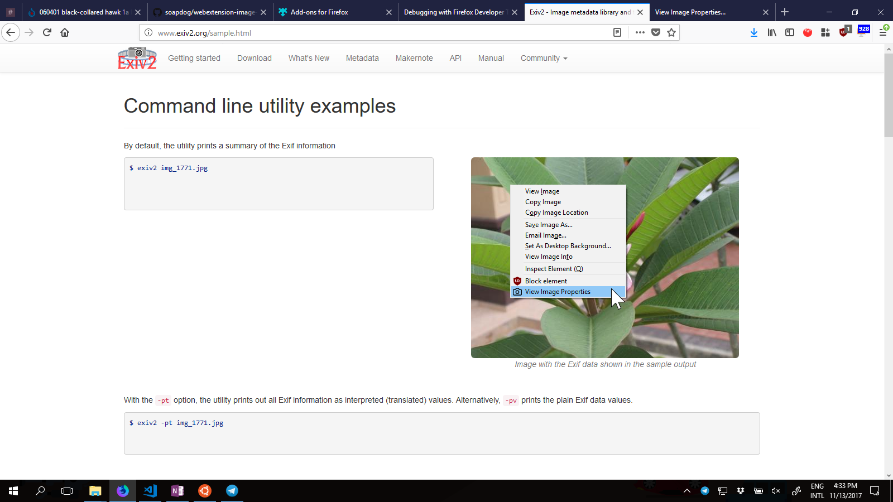

# Image Properties

This webextension adds a contextual menu that displays EXIF data for JPEGs

# How does it works?

It adds a contextual menu for JPEGs as can be seen below:

By selecting the __View Image Properties__ item, a new tab opens with the data from the image.
